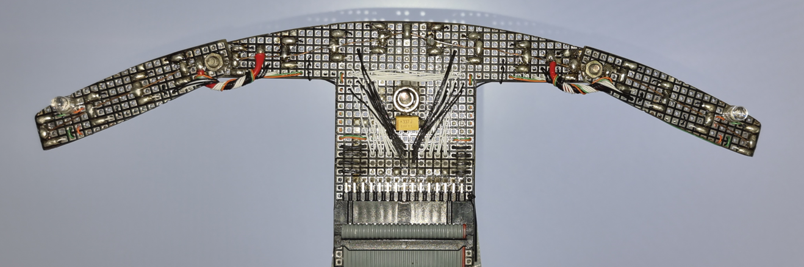
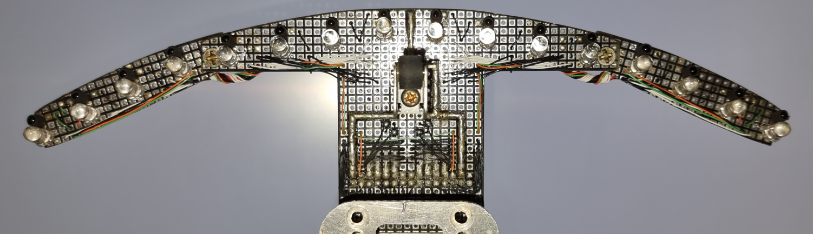
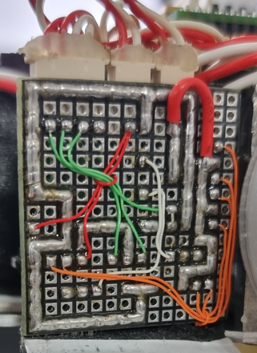
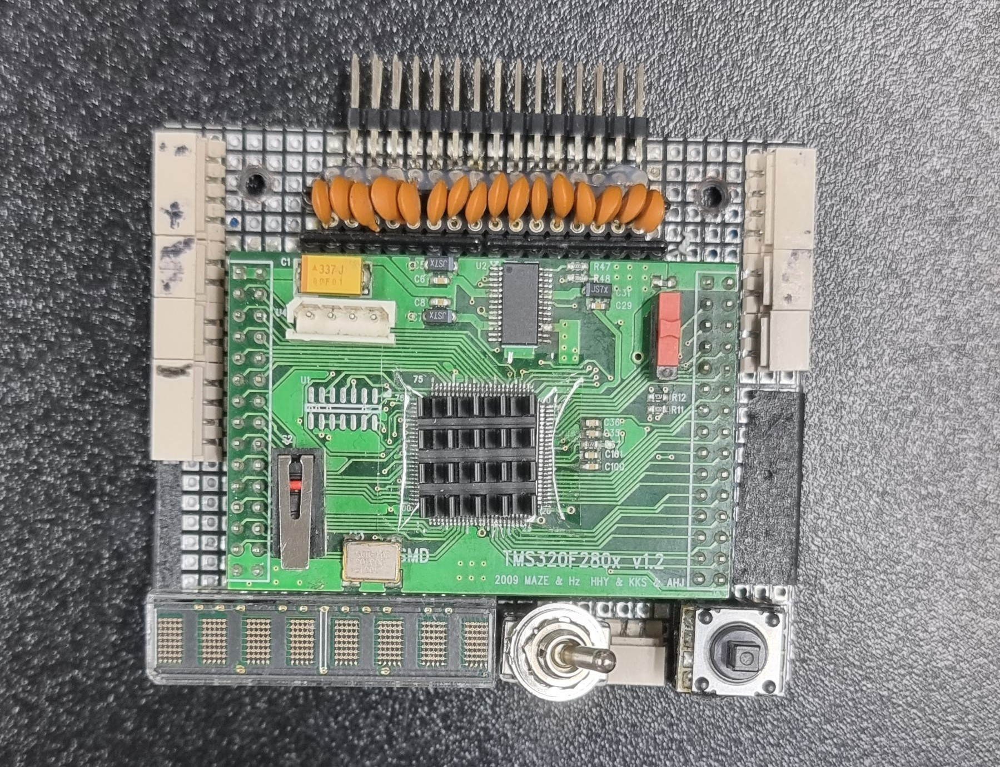
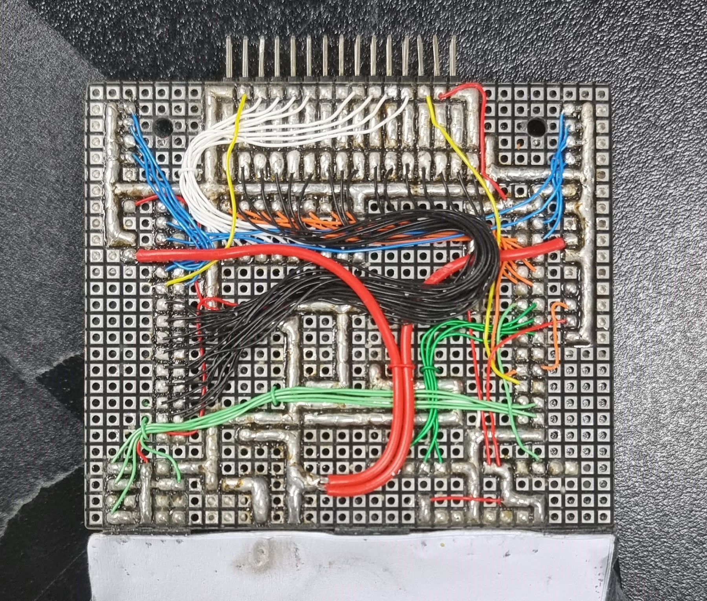
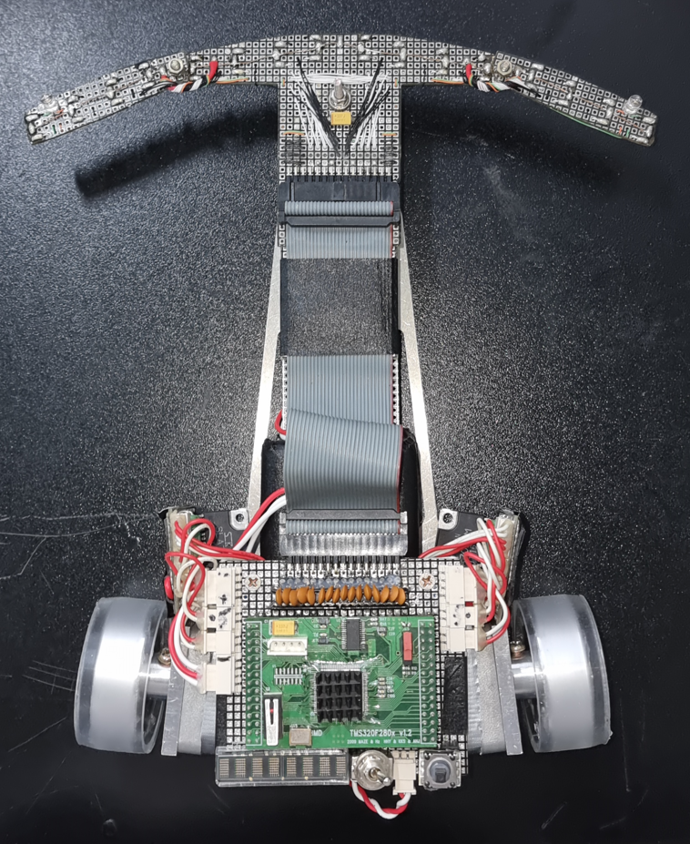
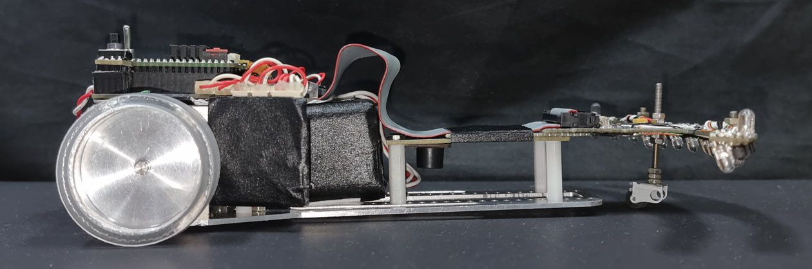
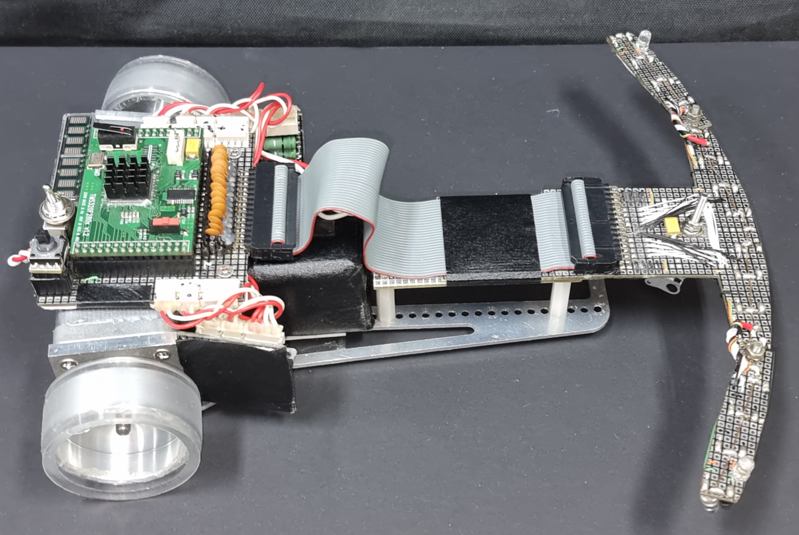

## **1. 스펙**

- CPU : TMS320F2809PZA

- Motor Driver : SLA7052M

- Motor : KH42JM2-901

- Sensor : IR 16조 (발광센서 : SI5312, 수광센서 : ST3811)

---

## **2. H/W**

### **센서부**

- 센서

  *SI5312*   
  

  *ST3811*   
  

- 센서보드 사진   

  윗면   
  

  아랫면   
     

영혼을 갈아넣어 만든 센서보드.   
단국대 대회 전 날에 한 번 부러지고 시립대 대회 전 날에 한 번 더 부러져서 살아있는게 기적 수준이다.   
3차 주행 소스를 테스트 중이였는데 가속했다가 턴마크를 놓치면서 감속을 못해 벽에 박아버렸다.

&nbsp;

### **구동부**

- MOTOR : **KH42JM2-901**   

  |VOLTAGE|CURRENT|HOLDING TORQUE|ROTOR INERTIA|WEIGHTS|
  |:---:|:---:|:---:|:---:|:---:|
  |3.42 *V*|1.2 *A*|236 *mN\*m*|56 *g\*cm²*|260 *g*|
    
  2017년도에는 **SST42D2120**이라는 스텝모터를 사용했다.   
  **KH42JM2-901**가 **SST42D2120**보다 **10g** 가볍고 주행 토크가 **8g*cm²** 더 강하다.   
  홀딩 토크는 좋지 않지만, 스텝모터를 사용한 라인트레이서는 주행 중 탈조 여부가 대회 성적을 결정하므로 최종 모터로 **KH42JM2-901**을 선택했다.

&nbsp;

- MOTOR DRIVER : **SLA7052M**   

  기존에 **SLA7026M** 과 **SLA7033M**을 사용했다.   
  위 두 모터 드라이버는 A, A/, B, B/에 MCU의 GPIO 출력으로 신호를 선택하여 모터를 구동하는 방식이다.   
  처음 트레이서를 만들 때, **SLA7026M**과 **L297**을 같이 사용하여 PWM신호 하나로 4가지 신호를 만들어 사용했다.   
  이 방식은 잡음이 심해서 모터가 중간중간 좋지 않은 소리를 내어 두 가지 소자를 통합한 **SLA7052M**을 찾아내게 된 것이다.

  단점 : 회로 구성이 어렵다. 그래서, 회로 시뮬레이터를 이용하여 회로 설계를 했다.  
  장점 : 4가지 신호를 만들기 위한 처리가 필요없다. 즉, 인터럽트 팬딩이나 기타 등등의 이유로 신호의 타이밍이 정확하지 않아서 모터가 탈조나지 않는다.

  

  

    
SLA7052M 회로도

    
  

  

    
VREF : 0V

    
    
VREF : 3.3V

    
  

  

  

  **VREF**은 모터 드라이버의 활성화를 결정하는 동시에 출력 전류를 결정하는 중요한 핀이다.

  - **VREF = (VDD * R2) / (R1 + R2)**

  - **IOUT = VREF / RS**

  두 식을 통해 출력 전류를 결정하여, 모터의 최종 토크를 결정한다.    
  [(스텝모터의 전압, 전류에 따른 토크 변화에 대하여 궁금하면 여기로)](https://www.designworldonline.com/improving-high-speed-performance-of-hybrid-stepper-motors/)   

  **R1**은 ***10Kohm***, **R2**는 가변저항인데 일정한 출력을 주기 위해 고정된 ***10Kohm*** 을 사용했다.   
  **2N3904**소자의 **Collector**와 모터 드라이버의 **VREF** 사이에 저항을 조절하여 **VREF** 에 인가될 전압을 조절해준다.

  **NI Multisim**을 사용하여 회로를 설계하고 회로를 직접 구현했다.

  모터 드라이버 아랫면   
  

&nbsp;

### **메인보드 및 프레임**

- 메인보드

  - 메인보드 사진

    윗면   
    

    아랫면   
    

  - 메인보드 구성은 다음과 같다.

    - **TMS320F2809PZA**   
    : **MCU**

    - **VFD** / HCMS-2971 / 색이나 길이에 따라 숫자가 다름, **LED**   
    : 디버깅용 패널

    - 조그스위치   
    : 조작용 스위치, 메뉴 SW를 만들어 로봇의 동작을 제어
    
    - 전원스위치, 전원부   
    : **50V**의 배터리를 **5V**로 변환하여 안정적으로 사용할 수 있게 함

    - **ULN2803**, **RC**필터, 센서보드와 연결되는 헤더핀   
    : **ULN2803**은 발광센서와 연결되며, 전류를 **MCU**가 아닌 전원부에서 끌어올 수 있게 함   
    : **RC**필터는 수광센서가 **ADC**핀으로 들어가기 전에 잡음 제거 역할

    - 모터드라이버 및 부저와 연결되는 터미널   
    : 모터드라이버에 **PWM**, **DIR**, **ONOFF** 등의 신호와 **50V**, **5V**, **GND**를 제공   
    : 부저에게 **PWM**, **5V**, **GND**를 제공

    - 전원스위치와 조그스위치 사이에 배터리와 연결되는 터미널   
    : 배터리(**50V**), 파워서플라이(**30V**)를 제공 받음

  - 주의사항

    **GPIO**에서 다른 소자로 연결되는 핀은 풀다운과 사이에 저항을 연결해서 쇼트를 방지해야 한다.
    
    조그스위치는 풀업으로 사용하여 MCU측에서 전류를 제공하지 않도록 설계해야 한다.

    메인보드의 크기는 상관이 없으나, 작으면 나중에 추가하기 어렵다.. ex) LED

    땜은 최대한 깔끔해야 디버깅이 용이하고, 전원이나 전류가 많이 필요한 신호선은 두꺼운 선을 쓰거나 누드땜으로 해야 한다.

  나는 작게 만들어서 LED 추가가 어려웠다... 그래서 센서보드에 LED가 달려있다.

- 프레임

  - 프레임 및 전체 사진

    윗면   
    

    옆면   
    

    쿼터뷰   
    

  특이하게 MAZE는 토인을 넣는다. 느낀 바 로는 회전에서 더 잘가지는 거 같은데...   
  아직 수식으로 어떤 영향이 있는지 확인하지 못해서 잘 모르겠다..   

  지금까지 써본 토인수치 6도, 5.6도, 0도   
  확실히 토인이 있으면 곡선을 잘가는데 이유는 나중에 공부해야 할듯...   
  잘 모르지만 토인은 필수인듯!

---

## 2. S/W

### **센서부**

&nbsp;

### **구동부**

&nbsp;

### **제어부**

---

코드 : [Github Link](https://github.com/nodang/LineTracer_Gara)