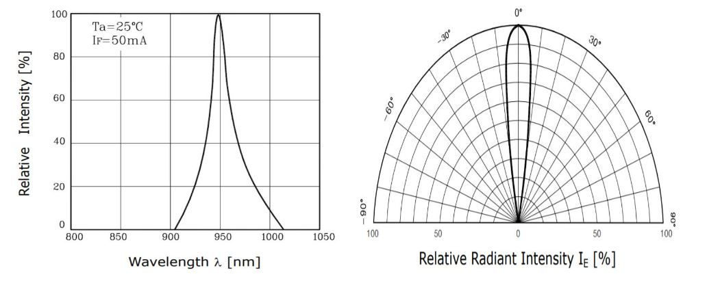
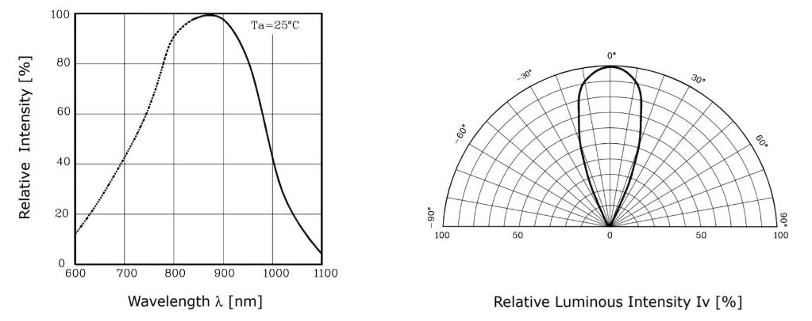
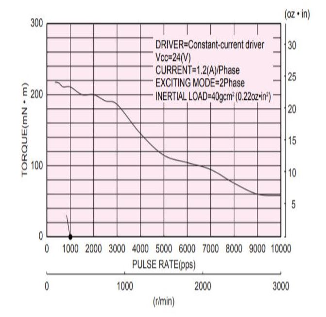
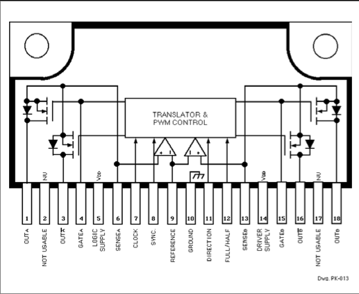
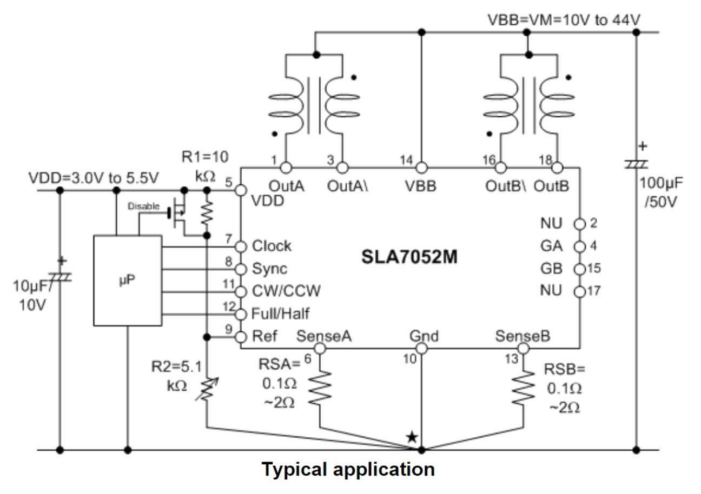
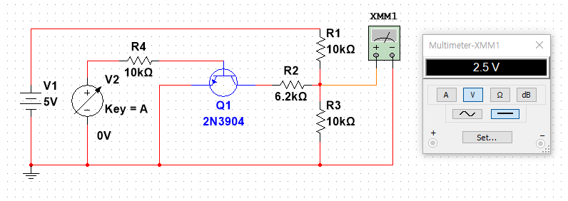
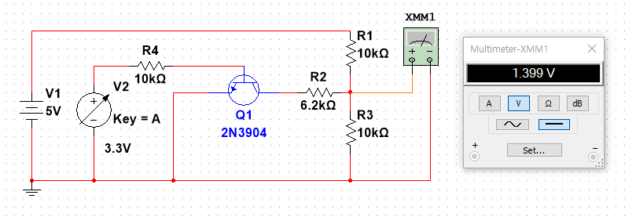

# 스펙

CPU           : TMS320F2809   
Motor Driver  : SLA7052M   
Motor         : KH42JM2-901   
Sensor        : IR 16조 (발광센서 : SI5312, 수광센서 : ST3811)

# 공통 H/W

# 공통 S/W

# 센서부

## H/W

**SI5312**   

**ST3811**   

센서보드 사진

## S/W

# 구동부

## H/W

### MOTOR : **KH42JM2-901**

|VOLTAGE|CURRENT|HOLDING TORQUE|ROTOR INERTIA|WEIGHTS|
|:---:|:---:|:---:|:---:|:---:|
|3.42 *V*|1.2 *A*|236 *mN\*m*|56 *g\*cm²*|260 *g*|

선정이유 :    
2017년도에는 **SST42D2120**이라는 스텝모터를 사용했다.   
**KH42JM2-901**가 **SST42D2120**보다 **10g** 가볍고 주행 토크가 **8g*cm²** 더 강하다.   
홀딩 토크는 좋지 않지만, 스텝모터를 사용한 라인트레이서는 주행 중 탈조 여부가 대회 성적을 결정하므로 최종 모터로 **KH42JM2-901**을 선택했다.

&nbsp;

### MOTOR DRIVER : **SLA7052M**   

선정이유 :    
기존에 **SLA7026M** 과 **SLA7033M**을 사용했다.   
위 두 모터 드라이버는 A, A/, B, B/에 MCU의 GPIO 출력으로 신호를 선택하여 모터를 구동하는 방식이다.   
처음 트레이서를 만들 때, **SLA7026M**과 **L297**을 같이 사용하여 PWM신호 하나로 4가지 신호를 만들어 사용했다.   
이 방식은 잡음이 심해서 모터가 중간중간 좋지 않은 소리를 내어 두 가지 소자를 통합한 **SLA7052M**을 찾아내게 된 것이다.

단점 : 회로 구성이 어렵다. 그래서, 회로 시뮬레이터를 이용하여 회로 설계를 했다.  
장점 : 4가지 신호를 만들기 위한 처리가 필요없다. 즉, 인터럽트 팬딩이나 기타 등등의 이유로 신호의 타이밍이 정확하지 않아서 모터가 탈조나지 않는다.

&nbsp;

  
SLA7052M 회로도

  

  
VREF : 0V

   
  
VREF : 3.3V

   

**VREF**은 모터 드라이버의 활성화를 결정하는 동시에 출력 전류를 결정하는 중요한 핀이다.

1. **VREF = (VDD * R2) / (R1 + R2)**   
2. **IOUT = VREF / RS**

두 식을 통해 출력 전류를 결정하여, 모터의 최종 토크를 결정한다.    
[(스텝모터의 전압, 전류에 따른 토크 변화에 대하여 궁금하면 여기로)](https://www.designworldonline.com/improving-high-speed-performance-of-hybrid-stepper-motors/)   

**R1**은 ***10Kohm***, **R2**는 가변저항인데 일정한 출력을 주기 위해 고정된 ***10Kohm*** 을 사용했다.   
**2N3904**소자의 **Collector**와 모터 드라이버의 **VREF** 사이에 저항을 조절하여 **VREF** 에 인가될 전압을 조절해준다.

**NI Multisim**을 사용하여 회로를 설계하고 회로를 직접 구현했다.

## S/W

# 제어부

코드 : [Github Link](https://github.com/nodang/LineTracer_Gara)